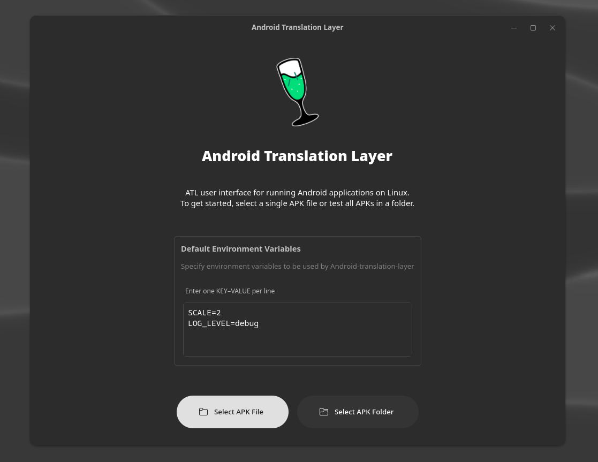
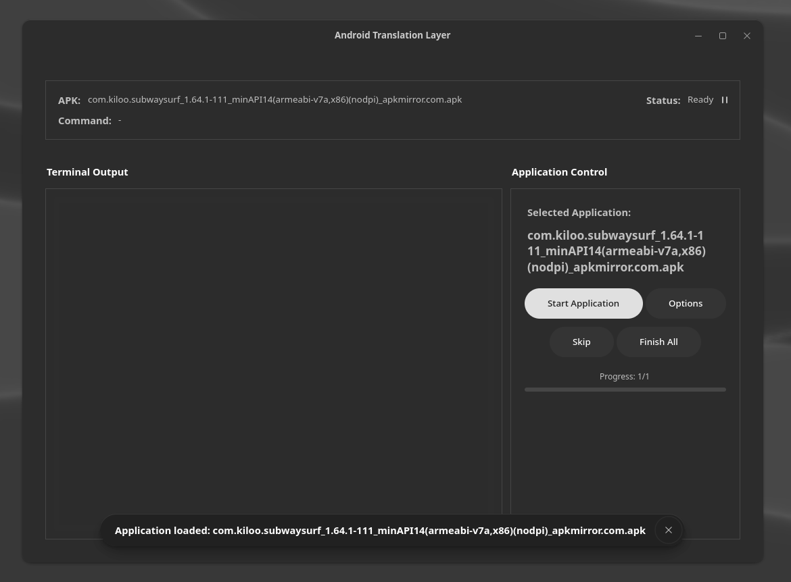
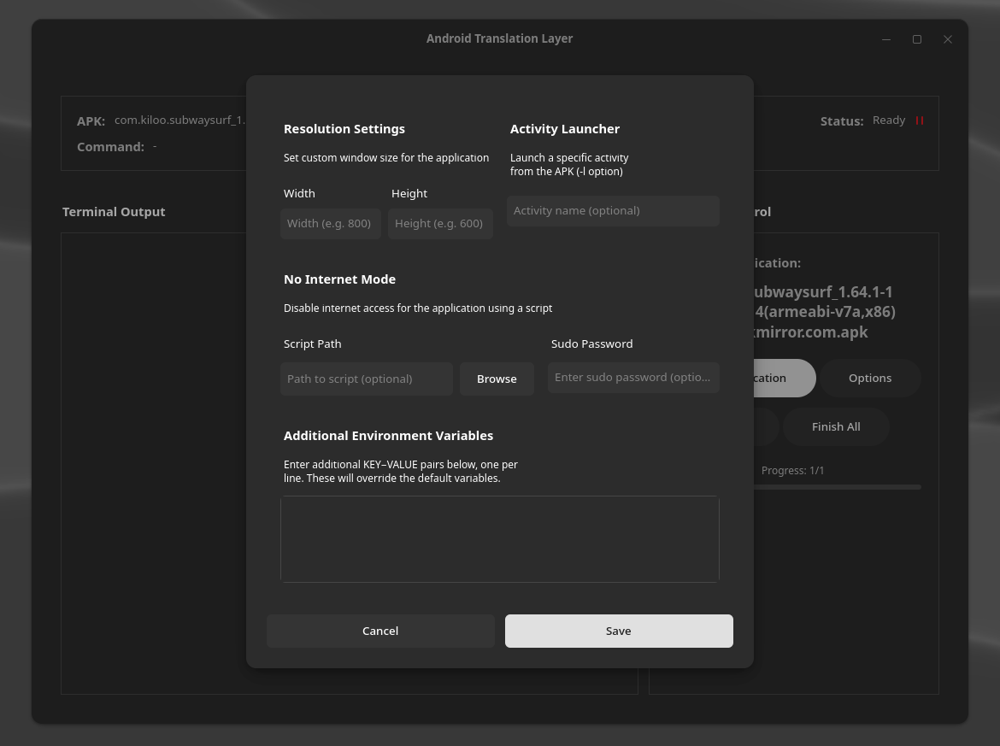
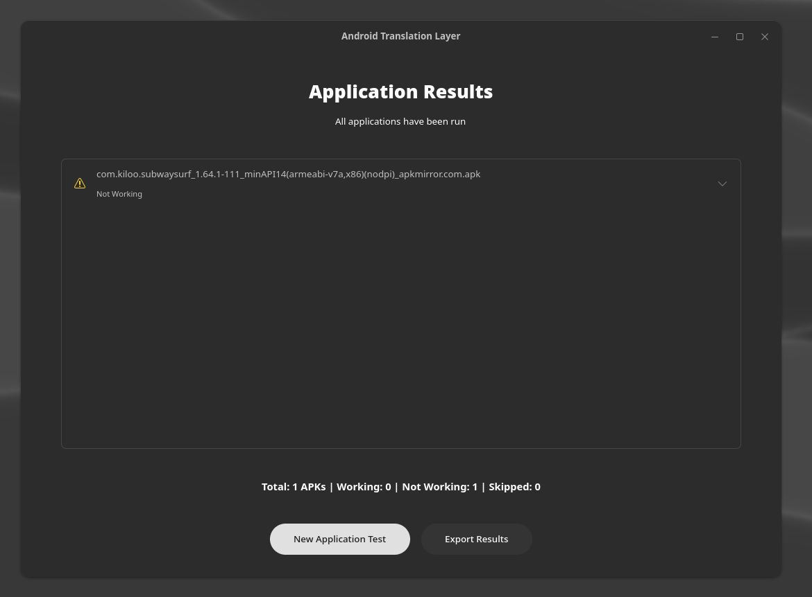
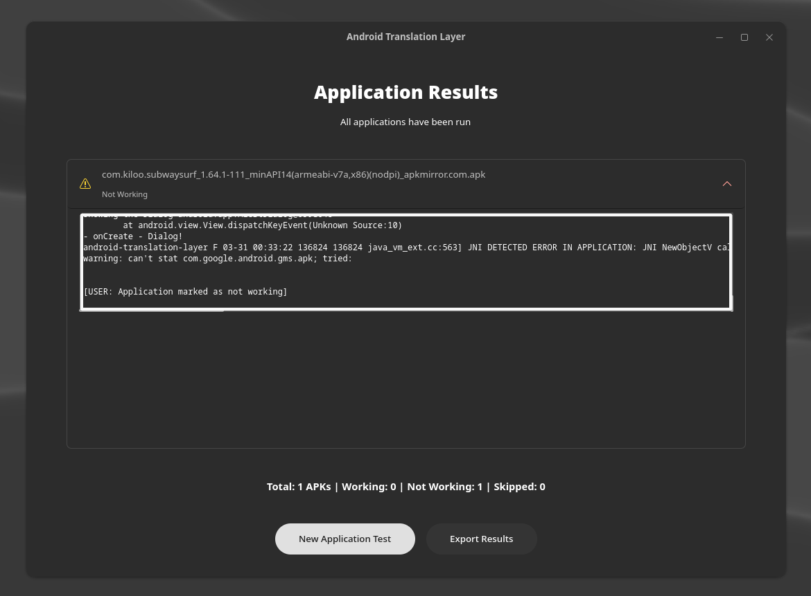

# Android Translation Layer GUI

<p align="center">
  
</p>

A sleek, modern **UNOFFICAL** GTK4 graphical user interface for Android Translation Layer that simplifies testing Android applications on Linux.

## Features

- 🚀 Run and test single APK files or entire directories
- 📋 Record test results (working/not working)
- 📊 Export detailed test reports
- 🔧 Configure custom environment variables
- 🌐 No-internet mode with custom scripts
- 📱 Custom resolution and activity settings
- 🔍 Automatic detection of application success/failure
- 🖥️ Terminal output monitoring

## Prerequisites

⚠️ **IMPORTANT**: This application requires `android-translation-layer` to be installed on your system. ATL GUI is just a frontend for the command-line tool.

If you haven't installed Android Translation Layer yet, please visit the [official repository](https://gitlab.com/android_translation_layer/android_translation_layer) for installation instructions.

For Arch Users, it's available in the AUR.
For Alpine Users, it's also available in alpine:edge repos.

## Installation

### Dependencies

#### Arch Linux and Derivatives (Manjaro, EndeavourOS, etc.)

```bash
sudo pacman -S python-gobject gtk4 libadwaita python-pip
```

#### Debian/Ubuntu and Derivatives (Pop!_OS, Linux Mint, etc.)

```bash
sudo apt install python3-gi python3-gi-cairo gir1.2-gtk-4.0 libadwaita-1-0 gir1.2-adw-1 python3-pip
```

#### Fedora

```bash
sudo dnf install python3-gobject gtk4 libadwaita python3-pip
```

#### openSUSE

```bash
sudo zypper install python3-gobject gtk4 libadwaita python3-pip
```

### Clone Repository

```bash
git clone https://github.com/os-guy/atl-gui.git
cd atl-gui
```

## Running the Application

The application is now available in a modularized version with improved code organization.
Make the script executable and run it:

```bash
chmod +x atl_gui.py
./atl_gui.py
```

Or using Python directly:

```bash
python3 atl_gui.py
```

## Directory Structure (Modular Version)

```
atl-tester/
├── atl_gui.py
├── res/                        # Resources directory
└── src/                        # Source code package
    ├── __init__.py             # Package marker
    ├── app.py                  # Application initialization
    ├── window.py               # Main window class
    ├── handlers/               # Event handlers
    │   ├── __init__.py
    │   ├── file_handlers.py    # File/folder selection handlers
    │   ├── test_handlers.py    # Testing process handlers
    │   ├── settings_handlers.py # Settings dialog handlers
    │   └── results_handlers.py  # Results view handlers
    ├── utils/                  # Utilities
    │   ├── __init__.py
    │   └── css_provider.py     # CSS styling setup
    └── views/                  # UI views
        ├── __init__.py
        ├── welcome_view.py     # Welcome screen
        ├── testing_view.py     # Testing screen
        └── results_view.py     # Results screen
```

## Usage Guide

1. **Start the application** using one of the methods described above.
2. **Set environment variables** (optional) - The app provides default variables like `SCALE=2` and `LOG_LEVEL=debug`.
3. **Select an APK file or folder** containing multiple APK files.
4. **Start the application** testing with the "Start Application" button.
5. **Configure additional options** (optional):
   - Set custom window dimensions
   - Specify an activity to launch
   - Enable no-internet mode with a custom script
   - Add additional environment variables
6. **Rate the application** as "Working" or "Not Working" after testing.
7. **Export results** when all tests are complete.

## No-Internet Mode

The application supports testing APKs without internet access by using a custom script. The script must:

1. Be executable (`chmod +x script.sh`)
2. Accept the android-translation-layer command as a parameter
3. Manage network access for the application

Note: Using this feature might require sudo access, which is why the application allows you to input your sudo password.

## Environment Variables

The application allows you to set environment variables for Android Translation Layer:

- Default variables are set in the welcome screen
- Application-specific variables can be set in the options dialog
- Additional variables will override default ones with the same name

## Screenshots

<details>
  <summary>Welcome Screen</summary>
  <p align="center">
    <br>
    <em>Welcome Screen - Configure environment variables and select APK</em>
  </p>
</details>

<details>
  <summary>Testing Screen</summary>
  <p align="center">
    <br>
    <em>Testing Screen - Run applications and monitor output</em>
  </p>
</details>

<details>
  <summary>Application Options</summary>
  <p align="center">
    <br>
    <em>Application Options - Configure resolution, activity, and network settings</em>
  </p>
</details>

<details>
  <summary>Results Screen</summary>
  <p align="center">
    <br>
    <em>Results Screen - View testing summary</em>
  </p>
</details>

<details>
  <summary>Detailed Results Log</summary>
  <p align="center">
    <br>
    <em>Detailed Results - Expand to view terminal output logs</em>
  </p>
</details>

## Modular Architecture Benefits

The modularized version maintains all the functionality of the original while providing:

- **Separation of concerns**: UI components and logic are cleanly separated
- **Clear module boundaries**: Each file has a specific purpose
- **Improved maintainability**: Easier to navigate and understand the codebase
- **Extensibility**: Simpler to add new features without affecting existing functionality

## Development

To modify or extend the application:

1. For UI changes, modify the appropriate file in `src/views/`
2. For new functionality, add handlers in `src/handlers/`
3. For utility functions, add them to existing or new files in `src/utils/`

The modular version uses Python's importing system to split the code while maintaining the same functionality:

- The original class methods are imported directly into the main `AtlGUIWindow` class
- Each UI component is defined in its own module with a create function
- CSS styling is extracted to a utility function

This approach maintains the same structure and behavior as the original while improving maintainability.

## License

This project is released under the GPL License. See the LICENSE file for details.

## Contributing

Contributions are welcome! Please feel free to submit a Pull Request.

## Author

Created by [os-guy](https://github.com/os-guy) 
