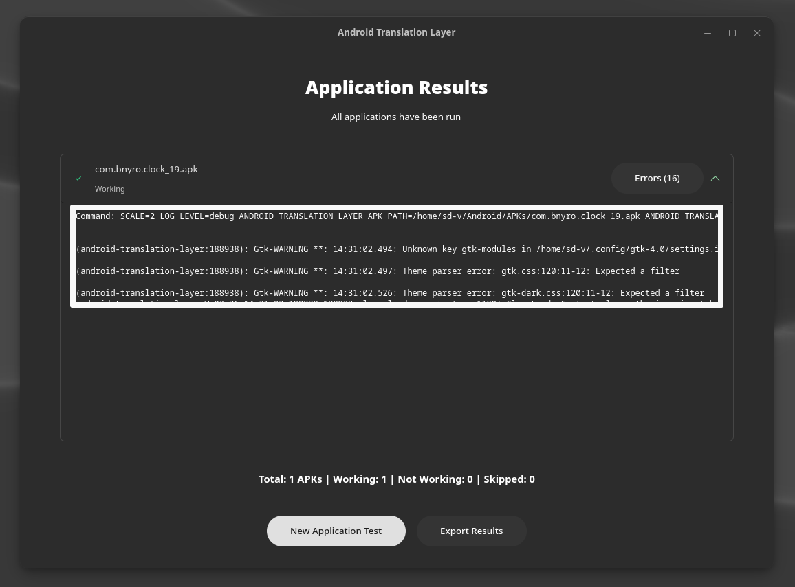

# Android Translation Layer GUI

<p align="center">
  
</p>

[](https://github.com/os-guy/atl-gui/stargazers)
[](https://aur.archlinux.org/packages/atl-gui-git)
[](https://github.com/os-guy/atl-gui)
[](https://github.com/os-guy/atl-gui/blob/main/LICENSE)

A modern GTK4 frontend for Android Translation Layer that simplifies testing Android applications on Linux.

## Features

- 🚀 Run single APK files or entire directories
- 📋 Track test results (working/not working)
- 📊 Export test reports
- 🔧 Configure environment variables
- 🌐 No-internet mode support
- 📱 Custom resolution and activity settings
- 🔍 Automatic success/failure detection
- 🖼️ Native Wayland and X11 support

## Prerequisites

⚠️ Requires `android-translation-layer` to be installed.
- Available in the AUR for Arch Linux users
- Available in alpine:edge repos for Alpine users
- [Official repository](https://gitlab.com/android_translation_layer/android_translation_layer)

## Installation

### Dependencies

```bash
# Arch Linux
sudo pacman -S python-gobject gtk4 libadwaita python-pip

# Debian/Ubuntu
sudo apt install python3-gi python3-gi-cairo gir1.2-gtk-4.0 libadwaita-1-0 gir1.2-adw-1 python3-pip

# Fedora
sudo dnf install python3-gobject gtk4 libadwaita python3-pip
```

### Run from Source

```bash
git clone https://github.com/os-guy/atl-gui.git
cd atl-gui
python3 atl_gui.py
```

### AppImage

```bash
cd appimage-build
./install.sh  # Creates AppImage and adds to menu
./uninstall.sh  # For removal
```

## Quick Usage

1. Start the application
2. Set environment variables (optional)
3. Select an APK file or folder
4. Configure additional options (resolution, activity, etc.)
5. Start testing
6. Rate application as "Working" or "Not Working"
7. Export results

## Screenshots

| Interface Section | Screenshot |
|-------------------|------------|
| Welcome Screen    |  |
| Testing Screen    |  |
| Options Dialog    |  |
| Results Screen    |  |
| Detailed Logs     |  |
| Error Analysis    |  |

## Command Line Options

```bash
# Wayland backend
./atl_gui.py --wayland

# X11 backend
./atl_gui.py --x11

# Show display environment info
./atl_gui.py --show-backend
```

## License

Released under the GPL License. See the LICENSE file for details.

## Author

Created by [os-guy](https://github.com/os-guy) 
